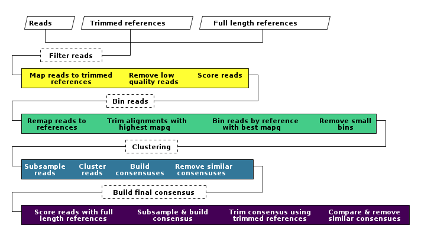

# pandoc-ditaa

Pandoc-ditaa is a pandoc lua filter that used ditaa to convert ascii digrams in markdown files into images.

## Use:

pandoc --lua-filter pandoc-ditaa

## Parameters:

1. java-path: path to java (can be used in ymal header)
  - Default: java (java in path), /usr/bin,,
    JAVA_HOME (not sure is set up right), JRE_HOME (not sure if set up right)
  - Change to java using the ymal header: java-path: /usr/local/jdk-1.8.0/bin/java
2. ditaa-path: path to ditaa aplication (can be used in ymal header)
  - Default target file: ditaa-0.11.0.jar, ditaa.jar, ditaa_0.9.jar (source forge download, no compile needed, but bit old)
  - Default path: working directory, /usr/local/bin, C:\\\\program\\files
  - Change path to ditaa using the ymal header: ditaa-path: /usr/local/bin/ditaa.jar

## Markdown syntax:

```

\```ditaa

diagram

[optional description here]
```

```

```
```ditaa
[ditaa settings here]

diagram

[This is a figure]{ #fig:pandoc-crossref tag here }
```
```


## Example:

```
```ditaa
[-S -W -E --scale 0.8]

   +---------+ +----------------------+ +--------------------------+
   |Reads{io}+ |Trimmed references{io}| |Full length references{io}|
   +---+-----+ +---------+------------+ +------------+-------------+
       |                 |                           |
       +-----------------+---------------------------+
      +-=-=-=-=-=-=+     |
+-----+Filter reads+-----+
|     +-=-=-=-=-=-=+
| +-----------------------------------------------+
+-+Map reads to trimmed  Remove low    Score reads+-+
  |     references      quality reads         cFF3| |
  +-----------------------------------------------+ |
                    +-=-=-=-=-+                     |
+-------------------+Bin reads+---------------------+
|                   +-=-=-=-=-+
| +--------------------------------------------------------------------------+
+-+Remap reads to  Trim alignments with  Bin reads by reference  Remove small+-+
  |  references       highest mapq           with best mapq    c4C8  bins    | |
  +--------------------------------------------------------------------------+ |
                        +-=-=-=-=-=+                                           |
+-----------------------+Clustering+-------------------------------------------+
|                       +-=-=-=-=-=+    
| +------------------------------------------------+
+-+Subsample  Cluster    Build    Remove similar   +-+
  |  reads     reads  consensuses  consensuses c379| |
  +------------------------------------------------+ |
                   +-=-=-=-=-=-=-=-=-=-=-+           |
+------------------+Build final consensus+-----------+
|                  +-=-=-=-=-=-=-=-=-=-=-+
| +---------------------------------------------------------------------------------+
+-+Score reads with full  Subsample & build  Trim consensus using  Compare & remove |
  |  length references        consensus  c405 trimmed references  similar consensues|
  +---------------------------------------------------------------------------------+

[
  Steps used in the co-infection pipeline to detect co-infections.
]{ #fig:pipeline }
```
```

To


